我已掌握全劇七天的文本與 canon-log 全部凍結事實。以下是設計交付。

# 分數 / flag / 結局系統

> 本檔為星野灯線（Day1～Day7）的分數 / flag / 結局判定主檔，供各 Day 規格與彙整表直接引用。所有變數命名、取得點、門檻邏輯均可直接套用。
> 設計鐵則：每個分數與 flag 都必須影響「後續對白 / 女主角態度 / 主角旁白 / 追加場景 / 回想 / Day7 結局語氣 / 結局分支」至少其一，否則標「刪除」。不做假選項、不做無意義點擊。
> 基調凍結：全結局維持苦甜・有餘韻・不完全擁有・彼此都被改變一點（A094）。本系統不會產生任何違反凍結結局規則（私奔／交換聯絡方式／正式交往／告白／英雄救美／經理人壞人）的分支。

---

## 0. 系統總覽

| 類型 | 變數 | 玩家可見？ | 主要作用 |
|---|---|---|---|
| 分數 | `affection_score` | 否（永遠不明示） | 灯的語氣／停頓／是否主動靠近 |
| 分數 | `distance_score` | 否 | 主角壓抑逃避度，高＝結局更淡更可惜 |
| 分數 | `awareness_score` | 否 | 主角對外部視線的理解，高＝避免誤判、看到不同旁白 |
| 分數 | `regret_score` | 否 | 沒問出口／沒追上去的累積，高＝Day7 更有錯過感 |
| flag | `memory_flags{...}` | 否 | 記憶錨點與一次性事件開關，控制回想／追加場景／結局語氣 |
| 結局 | `ending_tone` | 結算時揭曉 | warm_true / quiet_normal / bitter / hidden_pov |

設計原則：**四個分數都不對玩家顯示數值或進度條**。玩家只透過灯的反應、主角旁白的差異「感覺到」自己累積了什麼。這符合 A021（不是戀愛養成）與 A061（不把主題說破）。

分數區間建議：每個分數起始 0，單一選項變動以 ±1 為主、關鍵節點 ±2。各分數理論上限約 8～10，門檻邏輯見第 5 節。

---

## 1. affection_score（灯對主角的情感距離）

**定義**：不是「好感度條」，是「灯願意把多少普通的自己交給對方」。永不明示玩家。影響：灯的語氣（嘴硬 vs 鬆口）、台詞前的 `[pause]` 長度、是否主動縮短身體距離、Day7 收回護唇膏時握的時間長短。

### 取得點

| Day | 取得來源 | 變動 |
|---|---|---|
| Day1 | 選「想吃哪個自己挑」（把選擇權交給她）→ `+2`；選「妳從中午就沒吃了吧」（戳破她）→ `+1` 且 set `seen_through_flag` | +1～+2 |
| Day2 | 固定事件：兩塊油豆腐被她發現（「剛好是昨天那塊」）| +1（劇情固定） |
| Day3 | 選「今天想買哪個就買哪個」→ `+1`；雜誌架擋位為固定演出（不計分） | +1 |
| Day4 | 選「不接也可以」→ `+1`（她說「你很會讓人變壞」）；選「今天想吃布丁？」→ `+1`（她認真點頭） | +1～+2 |
| Day5 | 暗號軟分歧讀對爪印方向 → `+1`；留下油豆腐當實物回應 → `+1` set `vending_machine_memory` | +1～+2 |
| Day6 | 選「護唇膏還在我這」（順著她留理由）→ `+1`；選「像剛好同路」→ `+1` | +1～+2 |

### 第一次造成小變化（Day2）

`affection_score >= 2` 時，Day2 結尾灯的「謝謝你，記得那塊油豆腐」用 `[pause:1.2][text_speed:slow]` 並 `[expression: 素顏微笑]`；未達門檻則語氣較平、停頓短。這是玩家第一次「感覺到」她鬆口。

### 明顯回收（Day5～Day6）

- Day5：`affection_score >= 4` → 灯雖整日未登場，但留下的暗號圖多一個小護唇膏記號（A088 既定），旁白「她連這個都畫上去了」；未達則只有爪印無護唇膏記號。
- Day6 並肩走：`affection_score >= 5` → 她主動把距離縮到「半步」並低聲多說一句嘴硬真心（「油豆腐都還沒吃膩」用 `[pause:1.0]`）；未達則距離較遠、話更少。

### Day7 影響結局

`affection_score` 決定 Day7 護唇膏正面交還時：
- 高（>=6）：她「接過後握很久」，`[pause:2.0]`，說出「你今天，看著我了……那就，算了」全套；並解鎖未來可能性台詞「一塊給貓，一塊給很不會說謊的人」（A093）。
- 中（4～5）：握一下即收，台詞精簡。
- 低（<4）：她只說「還你了」，不延伸未來台詞——直接壓向 quiet_normal 或 bitter。

---

## 2. distance_score（主角的壓抑／逃避）

**定義**：主角把這段關係往「不能繼續」的方向推、自我設限、不肯承認期待的累積。高＝結局更淡更可惜（他親手讓溫度降下來）。

### 取得點

| Day | 取得來源 | 變動 |
|---|---|---|
| Day2 | 主角內心戲固定有壓抑（「還完，這件事就結束」）→ 基礎 `+1`（劇情固定） | +1 |
| Day4 | 選「不急的話，再吃一會」內含主角後退（他說「我只是說可以」之外，若玩家在 Day4 門口分支選「猶豫很久才去」）→ `+1` | +1 |
| Day4 | 回家把護唇膏「收進抽屜最裡面」為固定演出；若 `awareness_score` 低，旁白加一句逃避（見聯動） | 0/+1 |
| Day6 | 選「不回頭」→ `+1`；選「差點回頭」→ `0`（差點回頭代表沒那麼壓抑） | 0/+1 |
| Day7 | 選「把那片藏在標籤縫的紙收進口袋但不細看」→ `+1`；選「立刻讀懂並收好」→ `0` | 0/+1 |

### 第一次造成小變化（Day4）

`distance_score >= 2` 時，Day4 結尾把護唇膏收進抽屜的旁白變成更冷的版本：「像藏一個，不能被任何人發現的東西。包括我自己。」（多一句自我封閉）；低分版維持原文不加尾句。

### 明顯回收（Day6）

`distance_score >= 3` → Day6 大馬路口，主角旁白偏向「我應該讓這件事停在這裡」，灯伸手要回護唇膏時他差點真的給出去（製造「差點提前結束」的可惜感）；低分版維持「原來一支這麼小的東西，也能把明天留住」（A092c）的暖收。

### Day7 影響結局

`distance_score` 是「降溫器」：
- 低（<=2）：Day7 主角「這次看著她」乾脆、不退縮，推 warm_true。
- 高（>=4）：即使 `affection_score` 高，Day7 主角的看與話都慢半拍、留白多，旁白偏遺憾——把 warm_true 拉成 quiet_normal（見第 5 節判定）。
- distance 與 regret 同高 → bitter 的主要觸發來源。

---

## 3. awareness_score（主角對外部視線的理解）

**定義**：主角對推薦欄／目擊貼文／兩人同框風險的理解程度。高＝避免誤判、看到不同（更清醒）的旁白、Day6 更快讀懂「不能被同一鏡頭看成一組」。低＝看到較天真的旁白、Day6 慢一拍。**此分數不影響灯的好感，只影響主角視角的成熟度與安全感**。

### 取得點

| Day | 取得來源 | 變動 |
|---|---|---|
| Day2 | 灯點破「會跟過來的人眼睛會先飄過去，你連看都沒看」為固定演出；若玩家此前 Day1 選「戳破她」（已 set `seen_through_flag`）→ 主角這裡多一句理解 `+1` | 0/+1 |
| Day3 | 回家看到目擊貼文，固定 set `sns_post_seen`；玩家若選擇「坐起來認真看路口」分支 → `+1` | 0/+1 |
| Day4 | 午休「上午點開、下午又點開一模一樣的動作」後，玩家可選「把護唇膏收更深」（理解風險）→ `+1`，或「沒多想」→ `0` | 0/+1 |
| Day6 | 固定事件：路人舉手機拍雨棚（A092b）。`awareness_score >= 2` → 主角當場讀懂「不是不能見面，是不能被同一個鏡頭看成一組人」；未達則慢半拍由灯的動作帶他懂 | 門檻判定（不加分） |

### 第一次造成小變化（Day3 結尾）

`awareness_score >= 1` 時，Day3 看到目擊貼文的旁白多一句清醒判斷：「照片糊，但他們在比對路口。下次我站的位置要換。」（顯示他開始管理風險）；低分版只到「我認得那個路口」就停。

### 明顯回收（Day6）

見上表：`awareness_score >= 2` 讓主角在 Day6 自行讀懂同框風險（A092b 凍結句由主角內心先到、灯只補一句嘴硬），呈現「他成長了」；低分版維持原稿由灯動作帶他懂。**兩版都不違反 A092b，只改誰先懂。**

### Day7 影響結局

`awareness_score` 是 **hidden_pov_end 的開鎖鍵之一**，且決定 warm_true 的「乾淨度」：
- 高（>=3）：Day7 後日談主角在便利店看懂灯訪談裡「焦糖布丁」「普通的東西有時候很貴」的暗示（A093b），旁白「一般觀眾聽不懂，只有我懂」成立——這是 warm_true 的關鍵餘味。
- 低（<2）：後日談主角錯過訪談含意（螢幕一閃而過、他沒抬頭），餘味變淡 → 即使其他分數夠也只能到 quiet_normal。

---

## 4. regret_score（沒問出口／沒追上去）

**定義**：主角每一次「話到嘴邊沒說／該追沒追／該問沒問」的累積。高＝Day7 更有錯過感、結局更苦。這是 bitter_end 的主要燃料。

### 取得點

| Day | 取得來源 | 變動 |
|---|---|---|
| Day4 | 選「那明天想吃什麼？」→ 她說「你問得太早了」→ 主角沒追問就放下 → `+1`（問了卻沒接住）；選「今天想吃布丁？」→ `0` | 0/+1 |
| Day4 | 結尾她說「明天可能來不了」，主角只回「嗯」未挽留（固定）→ 基礎 `+1` | +1 |
| Day5 | 她整日未登場，玩家若選「什麼都不留只把收據收好」→ `+1`（沒回應她）；留油豆腐 → `0` | 0/+1 |
| Day6 | 大馬路口她塞回護唇膏，主角若選「不回頭」且未在心裡接話 → `+1`；選「差點回頭」→ `0` | 0/+1 |
| Day7 | 護唇膏交還後，主角若**未**說出未來可能性的接話（受 affection 低或 distance 高連鎖）→ `+1` | 0/+1 |

### 第一次造成小變化（Day4）

`regret_score >= 1` 時，Day4 結尾「她的背影走得比哪一天都慢」後加一句主角旁白：「我數到三，沒有叫住她。」（把沒追的動作顯影）；regret=0 則不加，背影句留白即可。

### 明顯回收（Day6）

`regret_score >= 2` → Day6 結尾主角掌心護唇膏旁白偏「我又一次，什麼都沒說」，與 A092c 暖句並置製造苦味；regret 低則純暖。

### Day7 影響結局

`regret_score` 是 **bitter_end 的主觸發**，並決定後日談的尾味：
- 低（<=1）：後日談主角在甜點櫃前買下焦糖布丁，「這一次，不是替誰買的。是我自己選的」（A093b）——苦甜偏甜、向前走。
- 高（>=3）：後日談保留買布丁動作，但旁白加錯過尾句：「我學會了自己選。只是學得太晚，沒能跟她說一聲。」——苦甜偏苦。

---

## 5. ending_tone 判定（可計算）

四種結局**全部維持苦甜基調**，差別只在「甜／淡／苦／餘味視角」的配比，不存在純 happy 或純 bad（符合 A094 凍結）。

判定在 Day7 結算時依序檢查，**由上往下，第一個命中者即為結局**。

```
# 前置：標準化（理論上限約 8～10，依實際投放校準）
warmth   = affection_score - distance_score        # 兩人之間實際留下的溫度
clarity  = awareness_score                          # 主角的清醒/看懂程度
miss      = regret_score                            # 錯過感

# 判定順序（短路）
1) hidden_pov_end:
   觸發 IF  awareness_score >= 3  AND  affection_score >= 5
            AND  memory_flags.sns_post_seen == True
            AND  memory_flags.almost_confession_flag == True
   → 在 warm_true 的結尾後，追加一段「灯視角」的隱藏尾聲（她在攝影棚的光裡，
      口袋按著護唇膏，內心獨白半句——仍不告白、不交換聯絡方式）。
   （這是 True End 的上位餘味視角，故門檻最高、且需玩家全程既親近又清醒。）

2) warm_true_end:
   觸發 IF  warmth >= 5  AND  awareness_score >= 2  AND  regret_score <= 2
   → 護唇膏正式回收 + 她握很久 + 「一塊給貓，一塊給很不會說謊的人」
      + 後日談偏甜版（A093b 訪談梗主角看懂）。

3) bitter_end:
   觸發 IF  regret_score >= 3  OR  distance_score >= 4
   → 護唇膏仍回收（基調不變），但她不延伸未來台詞、主角錯過訪談含意，
      後日談加錯過尾句。苦甜偏苦。

4) quiet_normal_end:（預設保底）
   以上皆未命中 → 標準苦甜版：護唇膏回收、平靜道別、後日談主角自己買布丁，
      不特別甜也不特別苦——「偷來的七天，安靜地還了回去」。
```

判定特性說明：
- **warmth = affection − distance**：即使灯很喜歡主角（affection 高），只要主角自己一直壓抑逃避（distance 高），溫度被抵銷，掉進 quiet_normal 或 bitter——對應「高=結局更淡更可惜」。
- **clarity 是門檻不是加分**：awareness 不夠（<2）永遠進不了 warm_true / hidden_pov，因為主角看不懂訪談梗、餘味成立不了。
- **miss 是 bitter 的單獨觸發**：regret>=3 直接壓向 bitter，即使溫度夠——對應「沒問出口的累積讓 Day7 更有錯過感」。
- **hidden_pov 需 `almost_confession_flag`**：玩家全程既靠近又清醒、且累積過「差點說出口」的時刻，才解鎖灯視角隱藏尾聲，作為對細膩玩家的獎勵，但仍不破壞「不告白」凍結。

---

## 6. memory_flags 明細（取得點 / 回收點 / 用途）

| flag | 取得點 | 回收點 | 用途・判定 |
|---|---|---|---|
| `lip_balm_flag` | Day1 收下護唇膏（固定 set True） | Day7 正面交還時清為 False（物歸原主） | 貫穿道具狀態；Day2/4/6 不收的演出皆檢查此 flag 為 True 才成立 |
| `seen_through_flag` | Day1 選「妳從中午就沒吃了吧」set True | Day2 灯點破「眼睛飄向」處 +1 awareness；Day7 她多一句「你從第一天就看穿我」 | 開啟 awareness 早鳥加成＋Day7 一句專屬台詞 |
| `cat_memory_flag` | Day1「我只看到一隻很急的貓」固定 set True | Day7 未來台詞「一塊給貓」需此 flag（永真，作回收檢核） | 貓梗回收檢核；缺則 Day7 不出現貓比喻（保險用，正常恆 True） |
| `oden_memory` | Day1 她選最油油豆腐 set True | Day7「自由是什麼味道」油豆腐回收（A093）；後日談主角買油豆腐 | 四記憶錨點之一；驅動 Day2 兩塊油豆腐演出與 Day7 回收 |
| `pudding_memory` | Day3 她自己買焦糖布丁 set True | Day4 撕蓋演出；Day7 訪談梗「焦糖布丁」；後日談主角買布丁 | 四記憶錨點之一；後日談甜味演出的必要條件 |
| `cocoa_memory` | Day4 主角投兩罐熱可可 set True | Day5 留溫熱可可暗號；Day7「自由是什麼味道」回收 | 四記憶錨點之一；Day5 暗號物與 Day7 回收 |
| `vending_machine_memory` | Day4 停車場長椅場景結束 set True | Day5 暗號地點＝停車場販賣機旁（沿用此記憶） | 鎖定 Day5 交換地點的合理性；缺則 Day5 需改寫帶入 |
| `sns_post_seen` | Day3 回家看到目擊貼文固定 set True | Day4 貼文升級；Day6 同框風險懂；hidden_pov 門檻之一 | 外部視線線索鏈；hidden_pov 必要 flag |
| `manager_warning_flag` | Day6 灯轉述「房卡由工作人員保管」set True | Day7 經理人給十分鐘「不是給妳約會，是整理狀態」呼應 | 經理人軟管控線索；Day7 經理人戲的鋪墊（非反派，A091） |
| `unread_message_flag` | Day4 她手機連震不接、反扣長椅 set True | Day6「經理人發現了」「那更可怕」升級 | 外部壓力升級鏈；驅動 Day4→Day6 壓力遞進 |
| `almost_confession_flag` | Day4 選「那明天想吃什麼？」她說「你問得太早了」，或 Day6 選「差點回頭」→ set True | Day7 hidden_pov_end 門檻之一 | 「差點說出口」累積；hidden_pov 解鎖鍵 |
| `rain_shelter_flag` | Day6 場景移至商店街雨棚 set True | Day7 見面地點＝同一雨棚盡頭（A093c），主角「是昨天我們分開的地方」 | 鎖定 Day7 見面地點合理性（無跟蹤感）；**保留，不刪** |

**刪除項**：無。原候選清單中所有 flag 均已綁定明確回收點，故全數保留。
（說明：`rain_shelter_flag`、`vending_machine_memory` 兩者看似只是地點記號，但因 A093c／A088 把「Day7 見面地點」「Day5 交換地點」的合理性綁在玩家是否經歷過該場景上，故有實際用途，不刪。）

---

## 7. 全劇流程圖（Day1 → Day7）

```mermaid
flowchart TD
    START([開始]) --> D1

    subgraph D1[Day1 後巷相遇]
        D1A{選項}
        D1A -->|想吃哪個自己挑| D1R1["affection +2"]
        D1A -->|妳從中午就沒吃了吧| D1R2["affection +1<br/>set seen_through_flag"]
        D1R1 & D1R2 --> D1F["固定 set: lip_balm_flag, cat_memory_flag,<br/>oden_memory<br/>她寫『如果明天還在這，就還給你』"]
    end
    D1F --> D2

    subgraph D2[Day2 兩塊油豆腐]
        D2X["固定: affection +1, distance +1<br/>她不收護唇膏"]
        D2X --> D2A{seen_through_flag?}
        D2A -->|True| D2R["awareness +1<br/>第一次小變化: 素顏微笑 pause"]
        D2A -->|False| D2N["平語氣版"]
    end
    D2R & D2N --> D3

    subgraph D3[Day3 自己進便利店]
        D3A{布丁選項}
        D3A -->|今天想買哪個就買哪個| D3R["affection +1"]
        D3A --> D3F["固定 set: pudding_memory<br/>雜誌架擋位(固定演出)"]
        D3F --> D3E["回家 set: sns_post_seen<br/>awareness>=1 → 清醒旁白"]
    end
    D3E --> D4

    subgraph D4[Day4 停車場 熱可可]
        D4G{門口去/猶豫}
        D4G --> D4A{接電話選項}
        D4A -->|不接也可以| D4R1["affection +1"]
        D4A --> D4B{吃什麼選項}
        D4B -->|今天想吃布丁| D4R2["affection +1"]
        D4B -->|那明天想吃什麼| D4R3["regret +1<br/>set almost_confession_flag"]
        D4R1 & D4R2 & D4R3 --> D4F["固定 set: cocoa_memory,<br/>vending_machine_memory,<br/>unread_message_flag<br/>她: 明天可能來不了 / 護唇膏先別丟"]
        D4F --> D4E["回家收抽屜<br/>distance>=2 → 冷版旁白"]
    end
    D4E --> D5

    subgraph D5[Day5 灯未登場・暗號]
        D5X["主角又多夾一塊油豆腐<br/>讀焦糖布丁收據背面暗號"]
        D5X --> D5A{爪印方向軟分歧}
        D5A -->|讀對| D5R["affection +1"]
        D5A --> D5B{回應方式}
        D5B -->|留油豆腐| D5R2["affection +1"]
        D5B -->|只收收據| D5R3["regret +1"]
    end
    D5R & D5R2 & D5R3 --> D6

    subgraph D6[Day6 雨棚 場景轉移]
        D6X["set: rain_shelter_flag, manager_warning_flag<br/>路人拍雨棚事件"]
        D6X --> D6AW{awareness>=2?}
        D6AW -->|是| D6W["主角自行讀懂同框風險"]
        D6AW -->|否| D6W2["灯動作帶他懂"]
        D6W & D6W2 --> D6A{回頭選項}
        D6A -->|不回頭| D6R1["distance +1, regret +1"]
        D6A -->|差點回頭| D6R2["set almost_confession_flag"]
        D6R1 & D6R2 --> D6B{護唇膏選項}
        D6B -->|護唇膏還在我這| D6R3["affection +1"]
        D6B --> D6F["她: 明天再還，最後一次<br/>lip_balm_flag 仍 True"]
    end
    D6F --> D7

    subgraph D7[Day7 雨棚盡頭 告別]
        D7X["挑出標籤縫紙片(肉球印+17:40+雨棚線)<br/>經理人給十分鐘(manager_warning呼應)"]
        D7X --> D7A{讀紙片}
        D7A -->|立刻讀懂收好| D7R0["distance +0"]
        D7A -->|收口袋不細看| D7R1["distance +1"]
        D7R0 & D7R1 --> D7C["護唇膏正面回收<br/>clear lip_balm_flag<br/>oden/pudding/cocoa 全回收"]
    end
    D7C --> CALC{{ending_tone 判定}}

    CALC -->|aware>=3 & aff>=5 &<br/>sns_post_seen & almost_confession| E_HID["hidden_pov_end<br/>追加灯視角隱藏尾聲"]
    CALC -->|warmth>=5 & aware>=2 &<br/>regret<=2| E_WARM["warm_true_end<br/>握很久+未來台詞+訪談梗看懂"]
    CALC -->|regret>=3 OR distance>=4| E_BIT["bitter_end<br/>不延伸未來台詞+錯過尾句"]
    CALC -->|其餘保底| E_NORM["quiet_normal_end<br/>平靜道別+自己買布丁"]

    E_HID & E_WARM & E_BIT & E_NORM --> AFTER["後日談: 甜味/淡味/苦味<br/>依結局調整(四錨點全回收)"]
    AFTER --> END([完結])
```



---

## 8. 套用備註（給各 Day 規格）

1. **分數一律後台累積、不顯示**。各 Day 規格中標 `affection +N` 等，僅為內部記帳。
2. **每個選項都不是假選項**：上表每個分支都對應「當場反應 / 中期回收 / Day7 回收 / 解鎖或封鎖內容」其一以上，Day 規格撰寫時必須把該選項的三段回收寫進該場。
3. **保底安全**：軟分歧（如 Day5 爪印方向、Day3 布丁選項）選「錯」不進 bad end，只少加分或多一兩句反應（沿用 A088 軟分岐原則）。
4. **凍結結局不可被任何分數組合突破**：四結局皆為苦甜變體，系統不存在「私奔 / 交往 / 告白 / 交換聯絡方式」的出口。hidden_pov 的灯視角尾聲也僅為內心半句，不告白、不留聯絡方式。
5. **命名即契約**：本檔變數名（`affection_score`、`distance_score`、`awareness_score`、`regret_score`、`ending_tone`、各 `memory_flags`）為跨檔唯一名稱，Day 規格與彙整表引用時不得改名。