# 流程圖與結局條件

> 本檔為星野灯線（Day1～Day7）的「全劇流程圖＋結局條件」最終交付。沿用主檔變數契約：`affection_score`／`distance_score`／`awareness_score`／`regret_score`／`ending_tone`／`memory_flags{...}`，不改名、不自創。所有分數後台累積、永不顯示玩家。

---

## 1. 全劇遊戲流程圖（Day1 → Day7）

### 1-A. 主線流程（mermaid）

```mermaid
flowchart TD
    START([開始]) --> D1

    subgraph D1["Day1 後巷相遇"]
        D1A{"S4 唯一選項"}
        D1A -->|"想吃哪個自己挑"| D1R1["affection +2"]
        D1A -->|"妳從中午就沒吃了吧"| D1R2["affection +1<br/>set seen_through_flag"]
        D1R1 & D1R2 --> D1F["固定 set: lip_balm_flag / cat_memory_flag / oden_memory<br/>護唇膏背面『如果明天還在這，就還給你』"]
    end
    D1F --> D2

    subgraph D2["Day2 兩塊油豆腐"]
        D2X["固定: affection +1 / distance +1"]
        D2X --> D2SEEN{"seen_through_flag?"}
        D2SEEN -->|True| D2AW["awareness +1（早鳥）"]
        D2SEEN -->|False| D2N["平語氣"]
        D2AW & D2N --> D2C{"S3『剛好』回應"}
        D2C -->|"A 不解釋 / B 嘴硬"| D2C0["distance +0"]
        D2C -->|"C 當作沒這回事"| D2C1["distance +1"]
        D2C0 & D2C1 --> D2C2{"S5 護唇膏定性"}
        D2C2 -->|"A 不定義 / B 保留期待"| D2D0["distance +0"]
        D2C2 -->|"C 還沒還成的任務"| D2D1["distance +1"]
        D2D0 & D2D1 --> D2GATE["affection>=2 → S5 素顏微笑結尾句"]
    end
    D2GATE --> D3

    subgraph D3["Day3 自己進便利店"]
        D3A{"S3 甜點櫃"}
        D3A -->|"今天想買哪個就買哪個"| D3R1["affection +1"]
        D3A -->|"今天不看熱量表？"| D3R0["affection +0"]
        D3R1 & D3R0 --> D3PUD["固定 set: pudding_memory"]
        D3PUD --> D3B{"S7 推薦欄"}
        D3B -->|"坐起來認真看路口"| D3R2["awareness +1"]
        D3B -->|"躺著滑過去"| D3R3["awareness +0"]
        D3R2 & D3R3 --> D3SNS["固定 set: sns_post_seen"]
    end
    D3SNS --> D4

    subgraph D4["Day4 停車場 熱可可"]
        D4A{"S1 貼文升級"}
        D4A -->|"收更深"| D4R1["awareness +1"]
        D4A -->|"沒多想"| D4R0["awareness +0"]
        D4R1 & D4R0 --> D4G{"S2 門口"}
        D4G -->|"直接走"| D4G0["distance +0"]
        D4G -->|"猶豫很久才去"| D4G1["distance +1"]
        D4G0 & D4G1 --> D4B{"S4 手機連震"}
        D4B -->|"不接也可以"| D4R2["affection +1"]
        D4B -->|"再吃一會"| D4R02["affection +0"]
        D4R2 & D4R02 --> D4C{"S5 想吃什麼"}
        D4C -->|"今天想吃布丁"| D4R3["affection +1"]
        D4C -->|"那明天想吃什麼"| D4R4["regret +1<br/>set almost_confession_flag"]
        D4R3 & D4R4 --> D4F["固定 set: cocoa_memory / vending_machine_memory /<br/>unread_message_flag　固定 regret +1（『嗯』未挽留）"]
        D4F --> D4E["回家收抽屜　distance>=2 → 冷版『包括我自己』"]
    end
    D4E --> D5

    subgraph D5["Day5 灯未登場・暗號"]
        D5A{"S3 爪印方向"}
        D5A -->|"C 讀對方向"| D5R1["affection +1"]
        D5A -->|"A 看時間 / B 記時刻"| D5R0["affection +0（零懲罰）"]
        D5R1 & D5R0 --> D5GATE["affection>=4 → 收據護唇膏記號版圖"]
        D5GATE --> D5B{"S5 實物回應"}
        D5B -->|"留油豆腐"| D5R2["affection +1<br/>確認 vending_machine_memory"]
        D5B -->|"什麼都不留"| D5R3["regret +1"]
        D5R2 & D5R3 --> D5SNS["sns_post_seen 升級（拍到販賣機角落）"]
    end
    D5SNS --> D6

    subgraph D6["Day6 雨棚 場景轉移"]
        D6X["固定 set: rain_shelter_flag / manager_warning_flag<br/>unread_message_flag 升級回收"]
        D6X --> D6A{"S2 回頭"}
        D6A -->|"不回頭"| D6R1["distance +1 / regret +1"]
        D6A -->|"差點回頭"| D6R2["set almost_confession_flag"]
        D6R1 & D6R2 --> D6AW{"awareness>=2?"}
        D6AW -->|是| D6W["主角自行讀懂同框風險"]
        D6AW -->|否| D6W2["灯動作帶他懂"]
        D6W & D6W2 --> D6B{"S3 剛好同路"}
        D6B -->|"像剛好同路（鬥嘴tag）"| D6R3["affection +1"]
        D6B -->|"很難（坦白tag）"| D6R4["affection +1"]
        D6R3 & D6R4 --> D6C{"S4 護唇膏理由"}
        D6C -->|"護唇膏還在我這"| D6R5["affection +1"]
        D6C -->|"那明天還來嗎"| D6R6["set almost_confession_flag"]
        D6R5 & D6R6 --> D6F["S5 護唇膏給出→塞回『明天再還，最後一次』<br/>埋標籤縫紙片伏線<br/>distance>=3 苦 / regret>=2 苦味旁白"]
    end
    D6F --> D7

    subgraph D7["Day7 雨棚盡頭 告別・結算"]
        D7X["S1 挑出紙片(肉球印+17:40+雨棚)<br/>S2 經理人給十分鐘＋暖暖包(manager_warning 回收)"]
        D7X --> D7A{"S3 讀紙片"}
        D7A -->|"立刻讀懂收好"| D7R0["distance +0"]
        D7A -->|"收口袋不細看"| D7R1["distance +1"]
        D7R0 & D7R1 --> D7C["S4 護唇膏正面回收・對視<br/>affection 決定握的時長"]
        D7C --> D7D{"S5/S6 接話"}
        D7D -->|"接住未來（aff>=6）"| D7R2["未來台詞全套<br/>regret +0"]
        D7D -->|"沒接住（aff<4 / dist>=4 / S5選B）"| D7R3["regret +1"]
        D7R2 & D7R3 --> D7E{"S6 自由味道"}
        D7E -->|"下次再買布丁"| D7PUD["pudding 線（S8 布丁閉環）"]
        D7E -->|"下次再吃油豆腐"| D7ODEN["oden 線（S8 沒多買油豆腐）"]
        D7PUD & D7ODEN --> D7G{"S7 道別"}
        D7G -->|"下次見"| D7G1["按口袋演出<br/>clear lip_balm_flag"]
        D7G -->|"再見"| D7G0["收束<br/>clear lip_balm_flag"]
    end
    D7G1 & D7G0 --> CALC{{"S8 ending_tone 判定（由上往下短路）"}}

    CALC -->|"aware>=3 & aff>=5 &<br/>sns_post_seen & almost_confession"| E_HID["hidden_pov_end<br/>warm 結尾＋灯視角隱藏尾聲"]
    CALC -->|"warmth>=5 & aware>=2 & regret<=2"| E_WARM["warm_true_end<br/>握很久＋未來台詞＋『只有我懂』"]
    CALC -->|"regret>=3 OR distance>=4"| E_BIT["bitter_end<br/>不延伸未來＋錯過尾句"]
    CALC -->|"其餘保底"| E_NORM["quiet_normal_end<br/>平靜道別＋自己買布丁"]

    E_HID & E_WARM & E_BIT & E_NORM --> AFTER["S8 後日談（四錨點全回收，依結局調味）"]
    AFTER --> END([完結 / 回想室解鎖])
```



### 1-B. flags 取得 → 回收對照表

| flag | 取得點 | 回收點 |
|---|---|---|
| `lip_balm_flag` | D1-S5（固定） | D2/D4/D6「不收」演出皆檢查 True → D7-S7 clear False（物歸原主） |
| `seen_through_flag` | D1-S4 選B | D2-S2 awareness +1 早鳥 → D7-S3「你從第一天就看穿我」 |
| `cat_memory_flag` | D1-S2（固定，恆 True） | D7-S6「一塊給貓」檢核 |
| `oden_memory` | D1-S4（固定） | D2-S3 兩塊油豆腐／D5-S2 手習慣多夾／D6-S4「油豆腐都還沒吃膩」／D7-S6「完全沒吃膩」／D7-S8「今天沒多買油豆腐」 |
| `pudding_memory` | D3-S3（固定） | D4-S4 撕蓋／D7-S6「下次再買布丁」／D7-S8 訪談「焦糖布丁」＋自己買布丁 |
| `cocoa_memory` | D4-S4（固定） | D5-S4/S5 熱可可暗號物／D7-S8 販賣機段回收 |
| `vending_machine_memory` | D4-S4（固定） | D5-S5 鎖定交換地點＝販賣機旁 |
| `sns_post_seen` | D3-S7（固定） | D4-S1/S6 升級／D5-S6 升級（販賣機角落）／D6-S1 地點曝光 → D7-S8 hidden_pov 門檻 |
| `unread_message_flag` | D4-S4（固定） | D6-S4「經理人發現了／那更可怕」升級回收 |
| `manager_warning_flag` | D6-S4（固定） | D7-S2 經理人給十分鐘＋暖暖包＋房卡 |
| `rain_shelter_flag` | D6-S2（固定） | D7-S1 看懂雨棚／D7-S2-S3 見面地點合理性（無跟蹤感） |
| `almost_confession_flag` | D4-S5 選B 或 D6-S2 差點回頭 或 D6-S4「那明天還來嗎」 | D7-S8 hidden_pov_end 門檻之一 |

### 1-C. 各分數理論累積上限（投放校準參考）

| 分數 | 最大取得路徑 | 上限 |
|---|---|---|
| `affection_score` | D1+2／D2+1／D3+1／D4+2／D5+2／D6+2 | 約 10 |
| `distance_score` | D2+1固定／D2-S3-C+1／D2-S5-C+1／D4-S2+1／D6-S2+1／D7-S3+1 | 約 6 |
| `awareness_score` | D2+1／D3+1／D4+1（門檻型，非疊加無上限） | 約 3 |
| `regret_score` | D4 固定+1／D4-S5-B+1／D5-S5-B+1／D6-S2+1／D7-S6+1 | 約 5 |

`warmth = affection − distance`；`clarity = awareness`；`miss = regret`。

---

## 2. 四種結局：觸發門檻、分數驅動差異、苦甜維持

> 判定在 D7-S8 由上往下短路，第一個命中即為結局。四結局**全部維持苦甜基調**（A094），無純 happy／純 bad，差別只在甜／淡／苦／餘味視角的配比。護唇膏在任何結局都正面回收，肉球印紙片在任何結局都被故意漏收（餘味物件）。

### 2-1. warm_true_end（暖・真結局）

**觸發門檻（可計算）**
```
warmth (= affection_score − distance_score) >= 5
AND awareness_score >= 2
AND regret_score <= 2
（且未先命中 hidden_pov）
```

**分數如何改變結局事件**

| 面向 | warm_true 呈現 |
|---|---|
| 她多說／少說一句 | D7-S6 說出未來可能性全套：「如果哪天，我真的可以，自己走進便利店」「我會自己買兩塊油豆腐」「一塊給貓」「一塊給——」（被經理人「灯，時間」打斷）。D7-S4「你今天，看著我了。那就……算了」全套，握護唇膏 `[pause:2.0]` 握很久。 |
| 主角旁白 | D7-S3 選 A 時「這次，我看著她，沒有退」（乾脆版）；D7-S8「一般觀眾聽不懂，只有我懂」（awareness>=3）／awareness=2 則看懂大半但無此獨白。 |
| BGM | D7-S4 主題旋律完整版進、「算了」後輕收不轉冷；D7-S8 結局主題完整版。 |
| 道具回收 | 護唇膏正面回收＋D7-S7「下次見」按口袋演出；四錨點全回收，後日談「這一次，不是替誰買的。是我自己選的」偏甜版。 |
| 是否出現她的視點 | 否（除非同時滿足 hidden_pov 門檻則升級為 hidden_pov_end）。 |

**苦甜維持**：未來台詞被經理人打斷＝不完全擁有；護唇膏物歸原主＝藉口結束；甜在「她願意想像下次」，苦在「下次沒有日期、明天她就不在這裡」。

### 2-2. quiet_normal_end（靜・常結局・保底）

**觸發門檻（可計算）**
```
未命中 hidden_pov / warm_true / bitter 的所有情況（保底）
典型成因：warmth < 5（多因 distance 偏高抵銷 affection）
　　　　　或 awareness < 2（看不懂訪談梗，餘味成立不了）
　　　　　且 regret <= 2、distance <= 3
```

**分數如何改變結局事件**

| 面向 | quiet_normal 呈現 |
|---|---|
| 她多說／少說一句 | D7-S6 未來台詞精簡為半句即被打斷，主角僅「嗯」；affection<4 時 D7-S4 她只說「還你了」，不延伸未來。 |
| 主角旁白 | D7-S8 訪談螢幕一閃而過、主角沒抬頭錯過含意（awareness<2）；買布丁僅「是我自己選的」，餘味平。 |
| BGM | D7-S4 對視仍進主題但收得快；D7-S8 結局主題平實版，不特別甜也不特別苦。 |
| 道具回收 | 護唇膏正面回收（基調不變）；四錨點仍全回收但無「只有我懂」加重；後日談「偷來的七天，安靜地還了回去」。 |
| 是否出現她的視點 | 否。 |

**苦甜維持**：平靜道別、主角自己買布丁＝主題（奪回選擇權）仍落地；不特別甜也不特別苦——「安靜地還回去」即苦甜。

### 2-3. bitter_end（苦・餘味結局）

**觸發門檻（可計算）**
```
regret_score >= 3  OR  distance_score >= 4
（且未先命中 hidden_pov / warm_true）
```
典型成因：D4-S5-B＋D5-S5-B＋D6-S2不回頭＋D7-S6 未接未來（regret 疊到 3）；或 D2-C／D4-S2／D6-S2／D7-S3 連選逃避（distance 疊到 4）。

**分數如何改變結局事件**

| 面向 | bitter_end 呈現 |
|---|---|
| 她多說／少說一句 | D7-S6 完全不延伸未來台詞（她在 D7-S4 已只說「還你了」）；D7-S5 鬥嘴她「哼」但苦味略多、不否認也不鬆口。 |
| 主角旁白 | D7-S3 選 B「我看著她。慢了一拍」（留白版）；D7-S8 主角錯過訪談含意（螢幕一閃、沒抬頭），追加錯過尾句：「我學會了自己選。只是學得太晚，沒能跟她說一聲。」 |
| BGM | D7-S4 對視 BGM 慢半拍進、留白多；D7-S8 結局主題收得更靜更冷。 |
| 道具回收 | 護唇膏仍正面回收（基調不破）；買布丁動作保留但加錯過尾句；四錨點回收但情感閉環缺一角。 |
| 是否出現她的視點 | 否（bitter 與 hidden_pov 互斥：hidden_pov 需 affection>=5 且通常 regret 低）。 |

**苦甜維持**：護唇膏仍回收、布丁仍自己買＝苦中仍有「他被改變一點」；苦在「他親手讓溫度降下來／話學得太晚」。**禁長篇傷感獨白**——錯過尾句只一句，點到為止。

### 2-4. hidden_pov_end（隱藏・灯視點上位真結局）

**觸發門檻（可計算，最高優先）**
```
awareness_score >= 3
AND affection_score >= 5
AND memory_flags.sns_post_seen == True
AND memory_flags.almost_confession_flag == True
→ 在 warm_true 全套結尾之後，追加一段「灯視角」隱藏尾聲
```
（玩家須全程既親近又清醒，且累積過「差點說出口」的時刻，故門檻最高。）

**分數如何改變結局事件**

| 面向 | hidden_pov_end 呈現 |
|---|---|
| 她多說／少說一句 | 先完整播放 warm_true 全套（未來台詞、握很久、「只有我懂」）；**追加灯視角內心半句**：攝影棚的光裡，她口袋按著護唇膏——內心獨白只到半句（仍不說破、不告白、不交換聯絡方式）。 |
| 主角旁白 | warm_true 全部主角旁白照常；尾聲切換為灯第一人稱，主角旁白退場，把「她也在想他」第一次（也是唯一一次）正面給玩家。 |
| BGM | warm_true 結局主題完整版後，灯視角尾聲轉入更輕、更私密的單音變奏，收在半句留白。 |
| 道具回收 | 與 warm_true 相同（護唇膏物歸原主、四錨點全回收、肉球印紙片故意漏收）；追加 hidden_pov 限定 CG「灯在攝影棚光裡按口袋」。 |
| 是否出現她的視點 | **是（唯一出現灯視點的結局）**，但僅內心半句，不破壞「不告白」凍結。 |

**苦甜維持**：她的內心被揭露＝甜的上位；但她仍選擇不聯絡、把護唇膏（那隻沒被收的貓）留在口袋＝不完全擁有的苦。這是給細膩玩家的獎勵，而非「在一起」的出口。

### 2-5. 四結局判定速查（短路順序）

```
1) hidden_pov_end : aware>=3 ∧ aff>=5 ∧ sns_post_seen ∧ almost_confession_flag
2) warm_true_end  : (aff−dist)>=5 ∧ aware>=2 ∧ regret<=2
3) bitter_end     : regret>=3 ∨ dist>=4
4) quiet_normal_end: 保底（其餘全部）
```
特性：warmth 用減法 → 主角越壓抑（distance 高）越把溫度抵銷；clarity 是門檻不是加分 → awareness<2 永遠進不了 warm/hidden；miss 是 bitter 單獨觸發 → regret>=3 直接壓苦。

---

## 3. Hidden POV / After Story 解鎖條件與內容

### 3-1. 解鎖條件（硬門檻）

```
awareness_score >= 3      ← 全程「看懂外部視線」：Day2 早鳥(需 seen_through)＋Day3 認真看路口＋Day4 收更深
AND affection_score >= 5  ← 全程把選擇權交給她、順著她留理由：Day1選A／Day3選A／Day4選A×2／Day5讀對+留油豆腐／Day6護唇膏還在我這
AND sns_post_seen == True ← Day3 必得（固定）
AND almost_confession_flag == True ← Day4「那明天想吃什麼」或 Day6「差點回頭」或 Day6「那明天還來嗎」任一
```
四者同時成立才在 warm_true 結尾後追加灯視點尾聲。任一不足 → 退回 warm_true（不出灯視點）。

### 3-2. 隱藏內容（四塊，皆不破壞凍結）

**（a）灯某天的內心視點——隱藏尾聲（攝影棚）**
warm_true 全套播完後，畫面切到她拍完最後一個工作、回到攝影棚的光裡。第一人稱灯：她口袋裡按著那支用了七天的護唇膏，內心只到半句——例如想到「那隻很急的貓，今天……」就停住，被工作人員叫走。**不告白、不寫聯絡方式、不承諾再見**。限定 CG「灯在攝影棚光裡按口袋」。

**（b）未讀訊息真相（回想室補完）**
回收 `unread_message_flag`：Day4／Day6 她口袋連震不接的那些訊息，在 hidden_pov 解鎖後於回想室顯示為「經理人的工作行程確認＋查房提醒」——證實經理人是軟管控而非反派（A091），她不接不是叛逆，是「想把這十分鐘留給自己」。**不顯示任何主角的聯絡方式**（兩人本就只用圖不用字）。

**（c）SNS 貼文真相（回想室補完）**
回收 `sns_post_seen` 升級鏈：那串「江東區／飯店附近／販賣機角落」目擊貼文，在 hidden_pov 解鎖後補一條旁白——拍到販賣機長椅角落「不該被拍到的東西」，其實是主角 Day5 留下的那罐未開封熱可可與油豆腐的影子；外界始終沒拍到「兩人同框」，他們的小世界從未真正被攻破，只是自己選擇收手。呼應「不能被同一鏡頭看成一組」（A092b）。

**（d）她注意到主角的瞬間（回想室・三格閃回）**
hidden_pov 專屬回放三個她「先看見主角」的瞬間，補上她當時的視角：
1. Day1 後巷——她蹲在水窪邊，**先確認的是主角的手與口袋有沒有伸向手機**，那一刻她已經在賭「這個人安全」。
2. Day2 暗處——「你站了二十分鐘」之前，她其實在路燈照不到處看了主角二十分鐘，數他眼睛有沒有飄向她住的方向。
3. Day6 雨棚——她推理出主角回家必經路線、繞了三條街找來，「貓看到獵物，盯著不放」的真正意思是：**是她先盯上他的**。

### 3-3. After Story（後日談・所有結局共通骨架，依結局調味）

共通：主角回家路過便利店不停、路過販賣機想起熱可可（cocoa 回收）、今天沒多買油豆腐（oden 回收）、口袋摸到肉球印紙片（護唇膏被收回、這隻貓被故意漏收）；幾天後電車滑到她訪談「焦糖布丁」，下車走進便利店甜點櫃自己買下焦糖布丁（pudding 回收＋主題落點「是我自己選的」）。
調味差異見第 2 節各結局「主角旁白／道具回收」欄。

---

## 4. 二周目 / Replay 價值

### 4-1. 台詞二周目顯示另一層意思（知道結局後重讀）

| 台詞 | 一周目讀法 | 二周目（已知她視點/結局）讀法 |
|---|---|---|
| D1「我只看到一隻很急的貓。」 | 主角機智裝傻 | 這是她決定賭他安全的起點；D7「一塊給貓」回扣，「貓」一直是她對自己的稱呼 |
| D1 護唇膏背面「如果明天還在這，就還給你」 | 可愛的再見藉口 | 她要還的從不是護唇膏，是「被當普通人對待的那個自己」——D7 才揭曉 |
| D2「你站了二十分鐘。」 | 她剛好路過看到 | hidden_pov 揭露她也站著看了主角二十分鐘，在做安全評估 |
| D2「謝謝你，記得那塊油豆腐。」 | 一句道謝 | affection>=2 才出現的素顏微笑句——二周目知道這是她第一次鬆口的計分證明 |
| D3「看最久的那個……通常買不起。」 | 放學回憶 | 焦糖布丁＝「普通很貴」主題種子，D7 訪談「焦糖布丁」「很貴」與後日談自己買布丁三度回收同一顆布丁 |
| D4「護唇膏，先別丟。因為我還沒說不要了。」 | 撒嬌留理由 | 「還沒說不要」＝信物規則（暗號代號），她在用唯一能用的方式說「還想見」 |
| D4「那明天想吃什麼？」她「你問得太早了」 | 被打槍 | 這一句 set `almost_confession_flag`，是 hidden_pov 的鑰匙之一——二周目玩家會特意選它 |
| D6「貓看到獵物，盯著不放。」 | 嘴硬解釋怎麼找來 | hidden_pov 揭露真正意思：是她先盯上他的 |
| D6「油豆腐都還沒吃膩。」 | 嘴硬的捨不得 | D7「完全沒吃膩」「我也是」回扣；affection>=5 才有的半步＋停頓版 |
| D7「你今天，看著我了。那就……算了。」 | 釋懷 | 「算了」＝不再需要藉口，但她握著不收＝捨不得；知道 hidden_pov 後讀出她口袋按護唇膏的對照 |

### 4-2. 選項前的細微提示（二周目可預判分支走向）

- **D1-S4 選項**：一周目無正解提示；二周目玩家已知「選 A（自己挑）墊高 warmth、選 B（戳破）開 seen_through 早鳥鏈」，可依目標結局分流。seen_through 線封鎖最快鬆口語氣，但解鎖 D7「你從第一天就看穿我」專屬句——二周目專門收集。
- **awareness 三連點（D2 早鳥／D3 看路口／D4 收更深）**：二周目玩家知道這是 warm_true（>=2）與 hidden_pov（>=3）的硬門檻，且 Day2 早鳥需 Day1 選 B——形成「D1 選 B → D2 早鳥 → D3 → D4」的清醒鏈，二周目才湊得齊 awareness>=3。
- **distance 降溫器（D2-C／D4-S2／D6-S2／D7-S3）**：二周目玩家知道每個「逃避型」選項都在抵銷 warmth，要 warm_true 就要全程避開；要 bitter（湊徽記）則反向連選。
- **almost_confession 三入口（D4-S5-B／D6-S2 差點回頭／D6-S4 那明天還來嗎）**：二周目玩家知道任一即可，但 regret 要壓在 <=2，故首選「差點回頭」（不加 regret）而非「那明天想吃什麼」（regret +1）——這是 hidden_pov 的最佳路徑設計。

### 4-3. 留言／旁白多顯示一行（依累積分數）

- **D5-S3 收據暗號圖**：`affection>=4` 時收據背面多顯示護唇膏記號＋旁白「她連這個都畫上去了」；未達只有肉球印。二周目高 affection 路線專屬截圖。
- **D2-S5 結尾**：`affection>=2` 時「謝謝你，記得那塊油豆腐」走素顏微笑＋`[pause:1.2]` 版；未達語氣平。
- **D4-S6 收抽屜**：`distance>=2` 多顯示冷尾句「包括我自己」；`awareness>=1` 多顯示「下次我站的位置要換」。
- **D4-S5 背影**：`regret>=1` 多顯示「我數到三，沒有叫住她」。
- **D6-S5 掌心護唇膏**：`regret>=2` 多顯示「我又一次，什麼都沒說」與暖句並置；`distance>=3` 主角旁白偏「我應該讓這件事停在這裡」。
- **D6-S3 同框風險**：`awareness>=2` 時凍結句「不是不能見面，是不能被同一個鏡頭看成一組人」由主角內心先到；未達由灯動作帶他懂——二周目玩家會察覺「誰先懂」隨清醒度改變。
- **D7-S8 後日談**：`awareness>=3` 多顯示「一般觀眾聽不懂，只有我懂」整句獨白；`regret>=3` 多顯示錯過尾句「只是學得太晚，沒能跟她說一聲」。
- **D6-S3 語氣 tag（鬥嘴／坦白）**：D7-S7 道別命中度——選過「很難（坦白）」者 D7「你真的很不會說謊」更貼；選過「像剛好同路（鬥嘴）」者「不准反悔」鬥嘴回收更貼。二周目玩家會為不同尾味語氣重玩。

**Replay 結構總結**：四結局徽記（warm／quiet／bitter／hidden）＋回想室四錨點縮圖（油豆腐／布丁／熱可可／護唇膏）＋hidden_pov 限定灯視點尾聲與三格閃回 CG，構成完整收集動機。bitter_end 結尾的錯過尾句同時作為「distance/regret 太高」的軟提示，引導玩家重玩拉回 warm_true。